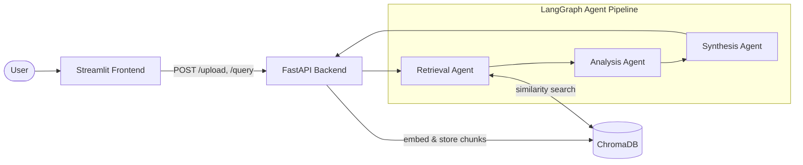

# Multi-Agent Research Platform

A research assistant that answers questions about your PDF documents using a
pipeline of three collaborating LLM agents. Upload one or more PDFs, ask a
question, and get back a structured, cited report — built on Retrieval
Augmented Generation (RAG) and LangGraph agent orchestration.

## How it works

A user uploads PDFs and asks a question. The question and the retrieved
context flow through three agents:

1. **Retrieval Agent** — searches the vector store for the passages most
   relevant to the question.
2. **Analysis Agent** — analyzes those passages, surfacing themes, patterns,
   and differing perspectives.
3. **Synthesis Agent** — turns the analysis into a structured report with
   citations back to the source passages.



## Tech stack

- **Python 3.11+**
- **LangChain** + **LangGraph** — RAG pipeline and agent orchestration
- **ChromaDB** — vector store
- **OpenAI API** — embeddings (`text-embedding-3-small`) and LLM (`gpt-4o-mini`)
- **FastAPI** + **uvicorn** — backend API
- **Streamlit** — frontend UI
- **Docker** + **Docker Compose** — containerization

## Prerequisites

- Python 3.11+
- Docker and Docker Compose
- An OpenAI API key

## Quick Start (Docker Compose)

1. Add your OpenAI API key to a `.env` file in the project root:
   ```
   OPENAI_API_KEY=sk-...
   ```
2. Build and start all services:
   ```
   docker compose up --build
   ```
3. Open the frontend:
   ```
   http://localhost:8501
   ```

This starts three services: `api` (FastAPI, port 8000), `frontend`
(Streamlit, port 8501), and `chromadb` (vector store, port 8100).

## API endpoints

| Method | Path      | Description                                                                 |
|--------|-----------|------------------------------------------------------------------------------|
| POST   | `/upload` | Accepts a PDF file, chunks it, embeds it, and adds it to the vector store. Returns the number of chunks created. |
| POST   | `/query`  | Accepts `{"query": "..."}`, runs the agent pipeline, and returns `retrieved_docs`, `analysis`, and `final_report`. Returns 400 if no documents have been uploaded yet. |
| GET    | `/health` | Returns `{"status": "healthy", "documents_loaded": bool}`.                   |

## Agents

| Agent               | File                              | Role                                                                 |
|---------------------|------------------------------------|-----------------------------------------------------------------------|
| Retrieval Agent      | `src/agents/retrieval_agent.py`   | Runs similarity search against the vector store for the user's query. |
| Analysis Agent       | `src/agents/analysis_agent.py`    | Analyzes the retrieved passages via `gpt-4o-mini`, identifying themes and patterns. |
| Synthesis Agent      | `src/agents/synthesis_agent.py`   | Generates the final structured report (summary, findings, comparison, conclusion) with citations. |

The three agents are wired together as a `StateGraph` in
`src/agents/graph.py`, sharing state (`query`, `retrieved_docs`, `analysis`,
`final_report`) defined in `src/agents/state.py`.

## Project structure

```
multi-agent-platform/
├── src/
│   ├── rag/
│   │   ├── document_loader.py    # PDF loading + chunking
│   │   └── vector_store.py       # ChromaDB + embeddings + retrieval
│   ├── agents/
│   │   ├── state.py              # shared AgentState
│   │   ├── retrieval_agent.py    # RAG retrieval node
│   │   ├── analysis_agent.py     # LLM analysis node
│   │   ├── synthesis_agent.py    # report generation node
│   │   └── graph.py              # LangGraph StateGraph orchestration
│   ├── api/
│   │   └── main.py               # FastAPI endpoints
│   └── frontend/
│       └── app.py                # Streamlit UI
├── docker/
│   ├── Dockerfile.api
│   └── Dockerfile.frontend
├── docker-compose.yml
├── requirements.txt
└── .env                          # OPENAI_API_KEY (not committed)
```

## Streamlit Cloud

A live demo deployment is planned but not yet published.
